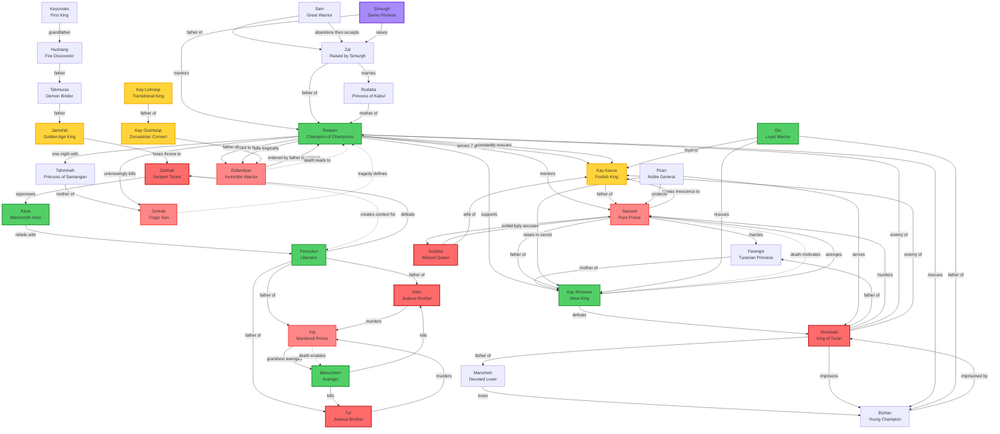

```mermaid
graph TD
    %% Mythical Era
    Keyumars[Keyumars<br/>First King]
    Hushang[Hushang<br/>Fire Discoverer]
    Tahmuras[Tahmuras<br/>Demon Binder]
    Jamshid[Jamshid<br/>Golden Age King]
    Zahhak[Zahhak<br/>Serpent Tyrant]
    Kava[Kava<br/>Blacksmith Hero]
    Fereydun[Fereydun<br/>Liberator]
    Salm[Salm<br/>Jealous Brother]
    Tur[Tur<br/>Jealous Brother]
    Iraj[Iraj<br/>Murdered Prince]
    Manuchehr[Manuchehr<br/>Avenger]

    %% Heroic Era - Rostam Line
    Sam[Sam<br/>Great Warrior]
    Zal[Zal<br/>Raised by Simurgh]
    Rudaba[Rudaba<br/>Princess of Kabul]
    Rostam[Rostam<br/>Champion of Champions]
    Tahmineh[Tahmineh<br/>Princess of Samangan]
    Sohrab[Sohrab<br/>Tragic Son]
    Simurgh[Simurgh<br/>Divine Phoenix]

    %% Kings of Iran
    KayKavus[Kay Kavus<br/>Foolish King]
    Sudaba[Sudaba<br/>Wicked Queen]
    Siavash[Siavash<br/>Pure Prince]
    Farangis[Farangis<br/>Turanian Princess]
    KayKhosrow[Kay Khosrow<br/>Wise King]
    KayLohrasp[Kay Lohrasp<br/>Transitional King]
    KayGoshtasp[Kay Goshtasp<br/>Zoroastrian Convert]
    Esfandiyar[Esfandiyar<br/>Invincible Warrior]

    %% Turan
    Afrasiyab[Afrasiyab<br/>King of Turan]
    Piran[Piran<br/>Noble General]
    Manizheh[Manizheh<br/>Devoted Lover]

    %% Other Heroes
    Giv[Giv<br/>Loyal Warrior]
    Bizhan[Bizhan<br/>Young Champion]

    %% Mythical Era Connections
    Keyumars -->|grandfather| Hushang
    Hushang -->|father| Tahmuras
    Tahmuras -->|father| Jamshid
    Jamshid -->|loses throne to| Zahhak
    Zahhak -->|oppresses| Kava
    Kava -->|rebels with| Fereydun
    Fereydun -->|defeats| Zahhak
    Fereydun -->|father of| Salm
    Fereydun -->|father of| Tur
    Fereydun -->|father of| Iraj
    Salm -->|murders| Iraj
    Tur -->|murders| Iraj
    Iraj -->|grandson avenges| Manuchehr
    Manuchehr -->|kills| Salm
    Manuchehr -->|kills| Tur

    %% Rostam Lineage
    Sam -->|father of| Zal
    Sam -->|abandons then accepts| Zal
    Simurgh -->|raises| Zal
    Simurgh -->|mentors| Rostam
    Zal -->|marries| Rudaba
    Zal -->|father of| Rostam
    Rudaba -->|mother of| Rostam
    Rostam -->|one night with| Tahmineh
    Tahmineh -->|mother of| Sohrab
    Rostam -->|unknowingly kills| Sohrab

    %% Rostam & Kings
    Rostam -->|serves 7 generations| KayKavus
    Rostam -->|constantly rescues| KayKavus
    Rostam -->|mentors| Siavash
    Rostam -->|supports| KayKhosrow
    Rostam -->|forced to fight| Esfandiyar
    Rostam -->|kills tragically| Esfandiyar

    %% Kayanid Dynasty
    KayKavus -->|father of| Siavash
    Sudaba -->|falsely accuses| Siavash
    Sudaba -->|wife of| KayKavus
    Siavash -->|proves innocence to| KayKavus
    Siavash -->|exiled by| Sudaba
    Siavash -->|marries| Farangis
    Afrasiyab -->|father of| Farangis
    Afrasiyab -->|murders| Siavash
    Farangis -->|mother of| KayKhosrow
    Siavash -->|father of| KayKhosrow
    KayKhosrow -->|avenges| Siavash
    KayKhosrow -->|defeats| Afrasiyab
    KayLohrasp -->|father of| KayGoshtasp
    KayGoshtasp -->|father of| Esfandiyar
    Esfandiyar -->|ordered by father to capture| Rostam

    %% Turan
    Afrasiyab -->|enemy of| Rostam
    Afrasiyab -->|enemy of| KayKavus
    Afrasiyab -->|father of| Manizheh
    Piran -->|protects| Siavash
    Piran -->|raises in secret| KayKhosrow
    Piran -->|serves| Afrasiyab
    Manizheh -->|loves| Bizhan
    Afrasiyab -->|imprisons| Bizhan
    Rostam -->|rescues| Bizhan

    %% Supporting Heroes
    Giv -->|father of| Bizhan
    Giv -->|rescues| KayKhosrow
    Giv -->|loyal to| KayKavus
    Bizhan -->|imprisoned by| Afrasiyab

    %% Critical Dependencies
    Zahhak -.->|creates context for| Fereydun
    Iraj -.->|death enables| Manuchehr
    Siavash -.->|death motivates| KayKhosrow
    Sohrab -.->|tragedy defines| Rostam
    Esfandiyar -.->|death leads to| Rostam

    %% Styling
    classDef villain fill:#ff6b6b,stroke:#c92a2a,stroke-width:3px
    classDef hero fill:#51cf66,stroke:#2f9e44,stroke-width:3px
    classDef king fill:#ffd43b,stroke:#fab005,stroke-width:3px
    classDef tragic fill:#ff8787,stroke:#fa5252,stroke-width:3px
    classDef divine fill:#a78bfa,stroke:#7c3aed,stroke-width:3px

    class Zahhak,Afrasiyab,Sudaba,Salm,Tur villain
    class Rostam,Fereydun,Kava,Manuchehr,Giv,KayKhosrow hero
    class Jamshid,KayKavus,KayGoshtasp,KayLohrasp king
    class Sohrab,Siavash,Iraj,Esfandiyar tragic
    class Simurgh divine
```