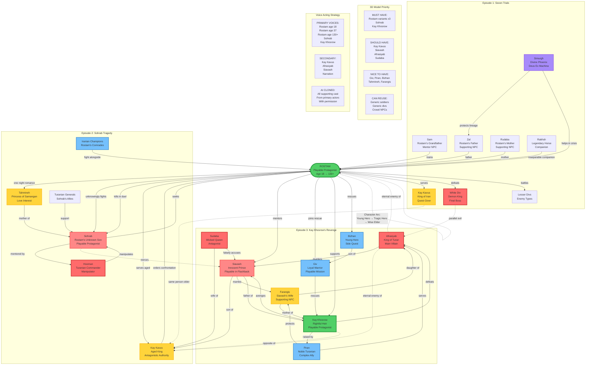

```mermaid
graph TD
    %% Central Character
    Rostam([ROSTAM<br/>Playable Protagonist<br/>Age 18 → 130+])

    %% Episode 1 Characters
    subgraph Episode1[Episode 1: Seven Trials]
        Sam[Sam<br/>Rostam's Grandfather<br/>Mentor NPC]
        Zal[Zal<br/>Rostam's Father<br/>Supporting NPC]
        Rudaba[Rudaba<br/>Rostam's Mother<br/>Supporting NPC]
        Rakhsh[Rakhsh<br/>Legendary Horse<br/>Companion]
        Simurgh[Simurgh<br/>Divine Phoenix<br/>Deus Ex Machina]
        KayKavus1[Kay Kavus<br/>King of Iran<br/>Quest Giver]
        WhiteDiv[White Div<br/>Demon King<br/>Final Boss]
        Divs[Lesser Divs<br/>Enemy Types]
    end

    %% Episode 2 Characters
    subgraph Episode2[Episode 2: Sohrab Tragedy]
        Tahmineh[Tahmineh<br/>Princess of Samangan<br/>Love Interest]
        Sohrab[Sohrab<br/>Rostam's Unknown Son<br/>Playable Protagonist]
        KayKavus2[Kay Kavus<br/>Aged King<br/>Antagonistic Authority]
        TuranGenerals[Turanian Generals<br/>Sohrab's Allies]
        IranChampions[Iranian Champions<br/>Rostam's Comrades]
        Hooman[Hooman<br/>Turanian Commander<br/>Manipulator]
    end

    %% Episode 3 Characters
    subgraph Episode3[Episode 3: Kay Khosrow's Revenge]
        Siavash[Siavash<br/>Innocent Prince<br/>Playable in Flashback]
        Sudaba[Sudaba<br/>Wicked Queen<br/>Antagonist]
        Farangis[Farangis<br/>Siavash's Wife<br/>Supporting NPC]
        KayKhosrow[Kay Khosrow<br/>Rightful Heir<br/>Playable Protagonist]
        Afrasiyab[Afrasiyab<br/>King of Turan<br/>Main Villain]
        Piran[Piran<br/>Noble Turanian<br/>Complex Ally]
        Giv[Giv<br/>Loyal Warrior<br/>Playable Mission]
        Bizhan[Bizhan<br/>Young Hero<br/>Side Quest]
    end

    %% Rostam's Relationships
    Sam -->|trains| Rostam
    Zal -->|father| Rostam
    Rudaba -->|mother| Rostam
    Simurgh -->|protects lineage| Zal
    Simurgh -->|helps in crisis| Rostam
    Rakhsh -->|inseparable companion| Rostam
    
    Rostam -->|serves| KayKavus1
    Rostam -->|defeats| WhiteDiv
    Rostam -->|battles| Divs
    
    Rostam -->|one night romance| Tahmineh
    Tahmineh -->|mother of| Sohrab
    Rostam -->|unknowingly fights| Sohrab
    Rostam -->|kills in duel| Sohrab
    Sohrab -->|seeks| Rostam
    Sohrab -->|mentored by| Hooman
    Hooman -->|manipulates| Sohrab
    KayKavus2 -->|orders confrontation| Rostam
    IranChampions -->|fight alongside| Rostam
    TuranGenerals -->|support| Sohrab
    
    Rostam -->|serves aged| KayKavus2
    Rostam -->|mentors| Siavash
    Siavash -->|son of| KayKavus2
    Sudaba -->|wife of| KayKavus2
    Sudaba -->|falsely accuses| Siavash
    Siavash -->|marries| Farangis
    Farangis -->|daughter of| Afrasiyab
    Afrasiyab -->|murders| Siavash
    Farangis -->|mother of| KayKhosrow
    Siavash -->|father of| KayKhosrow
    KayKhosrow -->|raised by| Piran
    Piran -->|serves| Afrasiyab
    Piran -->|protects| Farangis
    Giv -->|rescues| KayKhosrow
    Rostam -->|joins rescue| Giv
    Rostam -->|supports| KayKhosrow
    KayKhosrow -->|avenges| Siavash
    KayKhosrow -->|defeats| Afrasiyab
    Bizhan -->|son of| Giv
    Rostam -->|rescues| Bizhan

    %% Key Conflicts
    KayKavus1 -.->|same person older| KayKavus2
    Afrasiyab -.->|eternal enemy of| Rostam
    Afrasiyab -.->|eternal enemy of| KayKavus2
    
    %% Thematic Connections
    Sohrab -.->|mirrors| Siavash
    WhiteDiv -.->|parallel evil| Afrasiyab
    KayKhosrow -.->|opposite of| KayKavus2

    %% Character Development Through Episodes
    Rostam -.->|Character Arc:<br/>Young Hero → Tragic Hero → Wise Elder| Rostam

    %% Asset Priority
    subgraph AssetPriority[3D Model Priority]
        P1[MUST HAVE:<br/>Rostam variants x3<br/>Sohrab<br/>Kay Khosrow]
        P2[SHOULD HAVE:<br/>Kay Kavus<br/>Siavash<br/>Afrasiyab<br/>Sudaba]
        P3[NICE TO HAVE:<br/>Giv, Piran, Bizhan<br/>Tahmineh, Farangis]
        P4[CAN REUSE:<br/>Generic soldiers<br/>Generic divs<br/>Crowd NPCs]
    end

    %% Voice Acting Strategy
    subgraph VoiceActing[Voice Acting Strategy]
        V1[PRIMARY VOICES:<br/>Rostam age 18<br/>Rostam age 37<br/>Rostam age 130+<br/>Sohrab<br/>Kay Khosrow]
        V2[SECONDARY:<br/>Kay Kavus<br/>Afrasiyab<br/>Siavash<br/>Narration]
        V3[AI CLONED:<br/>All supporting cast<br/>From primary actors<br/>With permission]
    end

    %% Styling
    classDef protagonist fill:#51cf66,stroke:#2f9e44,stroke-width:4px
    classDef villain fill:#ff6b6b,stroke:#c92a2a,stroke-width:3px
    classDef tragic fill:#ff8787,stroke:#fa5252,stroke-width:3px
    classDef ally fill:#74c0fc,stroke:#1971c2,stroke-width:2px
    classDef divine fill:#a78bfa,stroke:#7c3aed,stroke-width:2px
    classDef neutral fill:#ffd43b,stroke:#fab005,stroke-width:2px

    class Rostam,Sohrab,KayKhosrow protagonist
    class WhiteDiv,Afrasiyab,Sudaba,Hooman villain
    class Siavash,Sohrab tragic
    class Giv,Piran,Bizhan,IranChampions ally
    class Simurgh divine
    class KayKavus1,KayKavus2,Tahmineh,Farangis neutral
```