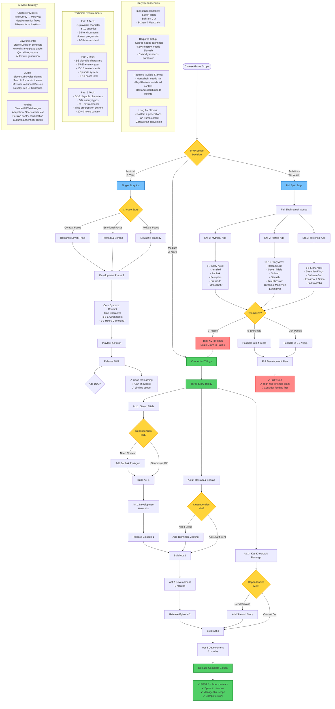

```mermaid
graph TD
    Start([Choose Game Scope])
    
    %% Development Paths
    Start --> MVP{MVP Scope<br/>Decision}
    
    MVP -->|Minimal<br/>1 Year| Path1[Single Story Arc]
    MVP -->|Medium<br/>2 Years| Path2[Connected Trilogy]
    MVP -->|Ambitious<br/>3+ Years| Path3[Full Epic Saga]
    
    %% Path 1: Minimal Viable Product
    Path1 --> Option1{Choose Story}
    Option1 -->|Combat Focus| SevenTrials[Rostam's Seven Trials]
    Option1 -->|Emotional Focus| SohrabStory[Rostam & Sohrab]
    Option1 -->|Political Focus| SiavashStory[Siavash's Tragedy]
    
    SevenTrials --> P1Dev1[Development Phase 1]
    SohrabStory --> P1Dev1
    SiavashStory --> P1Dev1
    
    P1Dev1 --> P1Core[Core Systems:<br/>- Combat<br/>- One Character<br/>- 3-5 Environments<br/>- 2-3 Hours Gameplay]
    P1Core --> P1Test[Playtest & Polish]
    P1Test --> P1Release[Release MVP]
    P1Release --> P1DLC{Add DLC?}
    
    %% Path 2: Connected Trilogy (RECOMMENDED)
    Path2 --> Trilogy[Three Story Trilogy]
    Trilogy --> Act1[Act 1: Seven Trials]
    Trilogy --> Act2[Act 2: Rostam & Sohrab]
    Trilogy --> Act3[Act 3: Kay Khosrow's Revenge]
    
    Act1 --> CheckDep1{Dependencies<br/>Met?}
    CheckDep1 -->|Need Context| AddZahhak[Add Zahhak Prologue]
    CheckDep1 -->|Standalone OK| BuildAct1[Build Act 1]
    AddZahhak --> BuildAct1
    
    BuildAct1 --> P2Dev1[Act 1 Development<br/>6 months]
    P2Dev1 --> Release1[Release Episode 1]
    
    Act2 --> CheckDep2{Dependencies<br/>Met?}
    CheckDep2 -->|Need Setup| AddTahmineh[Add Tahmineh Meeting]
    CheckDep2 -->|Act 1 Sufficient| BuildAct2[Build Act 2]
    AddTahmineh --> BuildAct2
    Release1 --> BuildAct2
    
    BuildAct2 --> P2Dev2[Act 2 Development<br/>6 months]
    P2Dev2 --> Release2[Release Episode 2]
    
    Act3 --> CheckDep3{Dependencies<br/>Met?}
    CheckDep3 -->|Need Siavash| AddSiavash[Add Siavash Story]
    CheckDep3 -->|Context OK| BuildAct3[Build Act 3]
    AddSiavash --> BuildAct3
    Release2 --> BuildAct3
    
    BuildAct3 --> P2Dev3[Act 3 Development<br/>6 months]
    P2Dev3 --> Release3[Release Complete Edition]
    
    %% Path 3: Full Epic
    Path3 --> FullScope[Full Shahnameh Scope]
    FullScope --> Era1[Era 1: Mythical Age]
    FullScope --> Era2[Era 2: Heroic Age]
    FullScope --> Era3[Era 3: Historical Age]
    
    Era1 --> E1Stories[5-7 Story Arcs:<br/>- Jamshid<br/>- Zahhak<br/>- Fereydun<br/>- Fratricide<br/>- Manuchehr]
    
    Era2 --> E2Stories[10-15 Story Arcs:<br/>- Rostam Line<br/>- Seven Trials<br/>- Sohrab<br/>- Siavash<br/>- Kay Khosrow<br/>- Bizhan & Manizheh<br/>- Esfandiyar]
    
    Era3 --> E3Stories[5-8 Story Arcs:<br/>- Sasanian Kings<br/>- Bahram Gur<br/>- Khosrow & Shirin<br/>- Fall to Arabs]
    
    E1Stories --> DevTeam{Team Size?}
    E2Stories --> DevTeam
    E3Stories --> DevTeam
    
    DevTeam -->|2 People| TooAmbitious[TOO AMBITIOUS<br/>Scale Down to Path 2]
    DevTeam -->|5-10 People| Possible[Possible in 3-4 Years]
    DevTeam -->|10+ People| Feasible[Feasible in 2-3 Years]
    
    TooAmbitious -.-> Path2
    Possible --> FullDev[Full Development Plan]
    Feasible --> FullDev
    
    %% Story Dependency Requirements
    subgraph StoryDeps[Story Dependencies]
        D1[Independent Stories:<br/>- Seven Trials<br/>- Bahram Gur<br/>- Bizhan & Manizheh]
        
        D2[Requires Setup:<br/>- Sohrab needs Tahmineh<br/>- Kay Khosrow needs Siavash<br/>- Esfandiyar needs Zoroaster]
        
        D3[Requires Multiple Stories:<br/>- Manuchehr needs Iraj<br/>- Kay Khosrow needs full context<br/>- Rostam's death needs lifetime]
        
        D4[Long Arc Stories:<br/>- Rostam 7 generations<br/>- Iran-Turan conflict<br/>- Zoroastrian conversion]
    end
    
    %% Technical Requirements by Path
    subgraph TechReq[Technical Requirements]
        T1[Path 1 Tech:<br/>- 1 playable character<br/>- 5-10 enemies<br/>- 3-5 environments<br/>- Linear progression<br/>- 2-3 hours content]
        
        T2[Path 2 Tech:<br/>- 2-3 playable characters<br/>- 15-20 enemy types<br/>- 10-15 environments<br/>- Episode system<br/>- 6-10 hours total]
        
        T3[Path 3 Tech:<br/>- 5-10 playable characters<br/>- 30+ enemy types<br/>- 30+ environments<br/>- Time progression system<br/>- 20-40 hours content]
    end
    
    %% Asset Requirements
    subgraph Assets[AI Asset Strategy]
        A1[Character Models:<br/>Midjourney → Meshy.ai<br/>MetaHuman for faces<br/>Mixamo for animations]
        
        A2[Environments:<br/>Stable Diffusion concepts<br/>Unreal Marketplace packs<br/>Quixel Megascans<br/>AI texture generation]
        
        A3[Audio:<br/>ElevenLabs voice cloning<br/>Suno AI for music themes<br/>Mix with traditional Persian<br/>Royalty-free SFX libraries]
        
        A4[Writing:<br/>Claude/GPT-4 dialogue<br/>Adapt from Shahnameh text<br/>Persian poetry consultation<br/>Cultural authenticity check]
    end
    
    %% Recommendations
    P1Release --> Recommend1[✓ Good for learning<br/>✓ Can showcase<br/>✗ Limited scope]
    Release3 --> Recommend2[✓ BEST for 2-person team<br/>✓ Episodic revenue<br/>✓ Manageable scope<br/>✓ Complete story]
    FullDev --> Recommend3[✓ Full vision<br/>✗ High risk for small team<br/>? Consider funding first]
    
    %% Styling
    classDef recommended fill:#51cf66,stroke:#2f9e44,stroke-width:3px
    classDef warning fill:#ff8787,stroke:#fa5252,stroke-width:2px
    classDef neutral fill:#74c0fc,stroke:#1971c2,stroke-width:2px
    classDef decision fill:#ffd43b,stroke:#fab005,stroke-width:2px
    
    class Path2,Trilogy,Release3,Recommend2 recommended
    class TooAmbitious,Recommend3 warning
    class Path1,Path3 neutral
    class MVP,Option1,CheckDep1,CheckDep2,CheckDep3,DevTeam decision
```