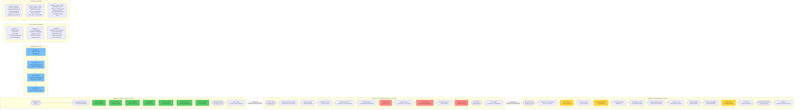

```mermaid
graph LR
    %% Episode 1: Seven Trials
    subgraph EP1[Episode 1: The Seven Trials - 2-3 Hours]
        E1_Start([Young Rostam<br/>Age 18])
        E1_Intro[Opening: Sam's Test<br/>Prove Yourself Worthy]
        E1_T1[Trial 1: Rakhsh<br/>Tame Wild Horse]
        E1_T2[Trial 2: Lion<br/>First Real Battle]
        E1_T3[Trial 3: Desert<br/>Survival Challenge]
        E1_T4[Trial 4: Witch<br/>Deception Test]
        E1_T5[Trial 5: Div Capture<br/>Magic Combat]
        E1_T6[Trial 6: Arzhang<br/>Powerful Div General]
        E1_T7[Trial 7: White Div<br/>FINAL BOSS]
        E1_End([Rostam Becomes<br/>Champion of Iran])
        E1_Hook[Post-Credits:<br/>Rostam meets Tahmineh]
        
        E1_Start --> E1_Intro
        E1_Intro --> E1_T1
        E1_T1 --> E1_T2
        E1_T2 --> E1_T3
        E1_T3 --> E1_T4
        E1_T4 --> E1_T5
        E1_T5 --> E1_T6
        E1_T6 --> E1_T7
        E1_T7 --> E1_End
        E1_End --> E1_Hook
    end
    
    %% Episode 2: Sohrab Tragedy
    subgraph EP2[Episode 2: The Tragedy of Sohrab - 3-4 Hours]
        E2_Start([17 Years Later<br/>Rostam Age 37])
        E2_P1[Prologue: Sohrab in Turan<br/>Young warrior seeks father]
        E2_P2[Play as Sohrab:<br/>Training montage]
        E2_P3[Sohrab's Journey:<br/>Crosses to Iran]
        E2_Switch[Switch to Rostam:<br/>Reports of Turanian warrior]
        E2_Conflict[Political Tension:<br/>Kay Kavus demands action]
        E2_Duel1[First Duel Day:<br/>Neither wins]
        E2_Night[Night Between:<br/>Both reflect - near misses]
        E2_Duel2[Second Duel:<br/>Rostam wounds Sohrab]
        E2_Reveal[Recognition Scene:<br/>The armband]
        E2_Death[Sohrab's Death:<br/>Greatest tragedy]
        E2_End([Aftermath:<br/>Rostam's Grief])
        E2_Hook[Post-Credits:<br/>Years pass, Siavash born]
        
        E2_Start --> E2_P1
        E2_P1 --> E2_P2
        E2_P2 --> E2_P3
        E2_P3 --> E2_Switch
        E2_Switch --> E2_Conflict
        E2_Conflict --> E2_Duel1
        E2_Duel1 --> E2_Night
        E2_Night --> E2_Duel2
        E2_Duel2 --> E2_Reveal
        E2_Reveal --> E2_Death
        E2_Death --> E2_End
        E2_End --> E2_Hook
    end
    
    %% Episode 3: Kay Khosrow's Revenge
    subgraph EP3[Episode 3: Blood of Kings - 4-5 Hours]
        E3_Start([Many Years Later<br/>Rostam Age 130])
        E3_P1[Flashback: Siavash's Story<br/>Player as Siavash]
        E3_Fire[Fire Ordeal:<br/>Prove innocence]
        E3_Exile[Journey to Turan:<br/>Peace attempt]
        E3_Murder[Siavash Murdered:<br/>By Afrasiyab]
        E3_Birth[Kay Khosrow Born:<br/>Hidden heir]
        E3_Time[Time Skip: 16 Years<br/>Kay Khosrow grows]
        E3_Rescue[Mission: Rescue Prince<br/>Play as Giv & Rostam]
        E3_Return[Return to Iran:<br/>Kay Khosrow crowned]
        E3_War1[First Campaign:<br/>Border conflicts]
        E3_War2[Second Campaign:<br/>Deep into Turan]
        E3_Boss[Final Battle:<br/>Afrasiyab's Defeat]
        E3_Justice[Execution:<br/>Justice for Siavash]
        E3_End([Kay Khosrow Ascends:<br/>Peace achieved])
        E3_Hook[Epilogue:<br/>Rostam continues serving]
        
        E3_Start --> E3_P1
        E3_P1 --> E3_Fire
        E3_Fire --> E3_Exile
        E3_Exile --> E3_Murder
        E3_Murder --> E3_Birth
        E3_Birth --> E3_Time
        E3_Time --> E3_Rescue
        E3_Rescue --> E3_Return
        E3_Return --> E3_War1
        E3_War1 --> E3_War2
        E3_War2 --> E3_Boss
        E3_Boss --> E3_Justice
        E3_Justice --> E3_End
        E3_End --> E3_Hook
    end
    
    %% Connections between episodes
    E1_Hook -->|Episode 2<br/>Releases 6-8 months later| E2_Start
    E2_Hook -->|Episode 3<br/>Releases 6-8 months later| E3_Start
    
    %% Parallel Development
    subgraph DevPlan[Development Timeline]
        Dev1[Months 1-6:<br/>Episode 1 Full Development]
        Dev2[Months 7-12:<br/>Episode 2 Development<br/>+ Episode 1 Support]
        Dev3[Months 13-18:<br/>Episode 3 Development<br/>+ Episodes 1-2 Support]
        Dev4[Months 19-20:<br/>Complete Edition Polish]
        
        Dev1 --> Dev2
        Dev2 --> Dev3
        Dev3 --> Dev4
    end
    
    %% Key Features per Episode
    subgraph Features[Core Features by Episode]
        F1[Episode 1:<br/>✓ Combat system<br/>✓ Exploration<br/>✓ Boss fights<br/>✓ Character progression<br/>✓ Tutorial integration]
        
        F2[Episode 2:<br/>✓ Dual protagonist<br/>✓ Emotional storytelling<br/>✓ Dialogue choices<br/>✓ Dueling mechanics<br/>✓ Tragedy system]
        
        F3[Episode 3:<br/>✓ Multi-character switching<br/>✓ Army management<br/>✓ Political decisions<br/>✓ Large-scale battles<br/>✓ Epic conclusion]
    end
    
    %% Asset Reuse Strategy
    subgraph AssetReuse[Asset Reuse Strategy]
        A1[Episode 1 Assets:<br/>- Rostam model base<br/>- Persian architecture set<br/>- Combat animations<br/>- Enemy divs/demons<br/>- Mountain environments]
        
        A2[Episode 2 Reuse + New:<br/>- Age up Rostam model<br/>- Add Sohrab model<br/>- Reuse combat system<br/>- New: Duel arena<br/>- New: Turan environments]
        
        A3[Episode 3 Reuse + New:<br/>- Old Rostam variant<br/>- Siavash + Kay Khosrow<br/>- Reuse all combat<br/>- New: Battlefield system<br/>- New: Palace intrigue areas]
    end
    
    %% Styling
    classDef episode1 fill:#51cf66,stroke:#2f9e44,stroke-width:2px
    classDef episode2 fill:#ff8787,stroke:#fa5252,stroke-width:2px
    classDef episode3 fill:#ffd43b,stroke:#fab005,stroke-width:2px
    classDef dev fill:#74c0fc,stroke:#1971c2,stroke-width:2px
    
    class E1_T1,E1_T2,E1_T3,E1_T4,E1_T5,E1_T6,E1_T7 episode1
    class E2_Duel1,E2_Duel2,E2_Death episode2
    class E3_Fire,E3_Murder,E3_Boss episode3
    class Dev1,Dev2,Dev3,Dev4 dev
```