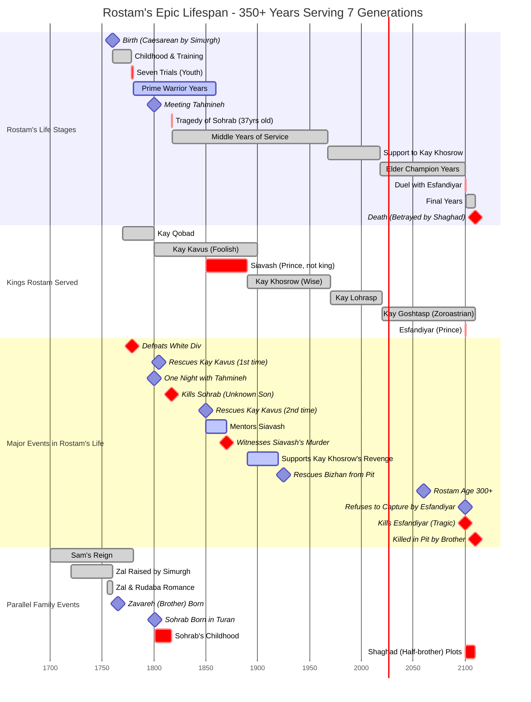

```mermaid
gantt
    title Rostam's Epic Lifespan - 350+ Years Serving 7 Generations
    dateFormat YYYY
    axisFormat %Y

    section Rostam's Life Stages
    Birth (Caesarean by Simurgh)    :milestone, 1760, 0y
    Childhood & Training             :done, r1, 1760, 18y
    Seven Trials (Youth)             :crit, r2, 1778, 2y
    Prime Warrior Years              :active, r3, 1780, 80y
    Meeting Tahmineh                 :milestone, 1800, 0y
    Tragedy of Sohrab (37yrs old)    :crit, r4, 1817, 1y
    Middle Years of Service          :done, r5, 1818, 150y
    Support to Kay Khosrow           :done, r6, 1968, 50y
    Elder Champion Years             :done, r7, 2018, 82y
    Duel with Esfandiyar             :crit, r8, 2100, 1y
    Final Years                      :done, r9, 2101, 9y
    Death (Betrayed by Shaghad)      :crit, milestone, 2110, 0y

    section Kings Rostam Served
    Kay Qobad                        :done, k1, 1770, 30y
    Kay Kavus (Foolish)              :done, k2, 1800, 100y
    Siavash (Prince, not king)       :crit, k3, 1850, 40y
    Kay Khosrow (Wise)               :done, k4, 1890, 80y
    Kay Lohrasp                      :done, k5, 1970, 50y
    Kay Goshtasp (Zoroastrian)       :done, k6, 2020, 90y
    Esfandiyar (Prince)              :crit, k7, 2100, 1y

    section Major Events in Rostam's Life
    Defeats White Div                :crit, milestone, e1, 1779, 0y
    Rescues Kay Kavus (1st time)     :milestone, e2, 1805, 0y
    One Night with Tahmineh          :milestone, e3, 1800, 0y
    Kills Sohrab (Unknown Son)       :crit, milestone, e4, 1817, 0y
    Rescues Kay Kavus (2nd time)     :milestone, e5, 1850, 0y
    Mentors Siavash                  :active, e6, 1850, 20y
    Witnesses Siavash's Murder       :crit, milestone, e7, 1870, 0y
    Supports Kay Khosrow's Revenge   :active, e8, 1890, 30y
    Rescues Bizhan from Pit          :milestone, e9, 1925, 0y
    Rostam Age 300+                  :milestone, e10, 2060, 0y
    Refuses to Capture by Esfandiyar :milestone, e11, 2100, 0y
    Kills Esfandiyar (Tragic)        :crit, milestone, e12, 2100, 0y
    Killed in Pit by Brother         :crit, milestone, e13, 2110, 0y

    section Parallel Family Events
    Sam's Reign                      :done, f1, 1700, 80y
    Zal Raised by Simurgh            :done, f2, 1720, 40y
    Zal & Rudaba Romance             :done, f3, 1755, 5y
    Zavareh (Brother) Born           :milestone, f4, 1765, 0y
    Sohrab Born in Turan             :milestone, f5, 1801, 0y
    Sohrab's Childhood               :crit, f6, 1801, 16y
    Shaghad (Half-brother) Plots     :crit, f7, 2100, 10y
```