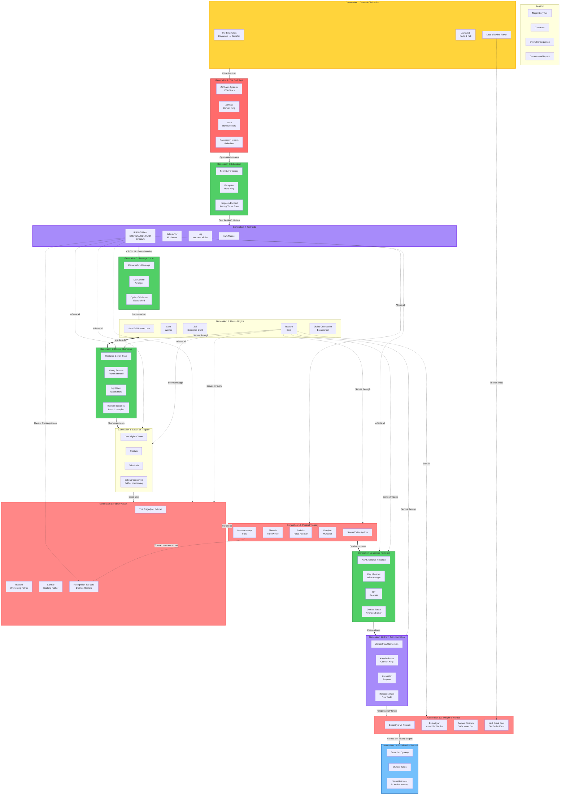

```mermaid
graph TB
    %% Legend
    subgraph Legend
        L1[Major Story Arc]
        L2[Character]
        L3[Event/Consequence]
        L4[Generational Impact]
    end

    %% Generation 1 - Mythical Founding
    subgraph Gen1[Generation 1: Dawn of Civilization]
        G1_Story[The First Kings<br/>Keyumars → Jamshid]
        G1_Char1[Jamshid<br/>Pride & Fall]
        G1_Event[Loss of Divine Favor]
    end

    %% Generation 2 - Tyranny
    subgraph Gen2[Generation 2: The Dark Age]
        G2_Story[Zahhak's Tyranny<br/>1000 Years]
        G2_Char1[Zahhak<br/>Demon King]
        G2_Char2[Kava<br/>Revolutionary]
        G2_Event[Oppression breeds<br/>Rebellion]
    end

    %% Generation 3 - Liberation
    subgraph Gen3[Generation 3: Liberation]
        G3_Story[Fereydun's Victory]
        G3_Char1[Fereydun<br/>Hero King]
        G3_Event[Kingdom Divided<br/>Among Three Sons]
    end

    %% Generation 4 - Original Sin
    subgraph Gen4[Generation 4: Fratricide]
        G4_Story[Iraj's Murder]
        G4_Char1[Salm & Tur<br/>Murderers]
        G4_Char2[Iraj<br/>Innocent Victim]
        G4_Event[IRAN-TURAN<br/>ETERNAL CONFLICT<br/>BEGINS]
    end

    %% Generation 5 - Vengeance
    subgraph Gen5[Generation 5: Revenge Cycle]
        G5_Story[Manuchehr's Revenge]
        G5_Char1[Manuchehr<br/>Avenger]
        G5_Event[Cycle of Violence<br/>Established]
    end

    %% Generation 6-12 - Rostam Era Begins
    subgraph Gen6[Generation 6: Hero's Origins]
        G6_Story[Sam-Zal-Rostam Line]
        G6_Char1[Sam<br/>Warrior]
        G6_Char2[Zal<br/>Simurgh's Child]
        G6_Char3[Rostam<br/>Born]
        G6_Event[Divine Connection<br/>Established]
    end

    %% Generation 7 - Seven Trials
    subgraph Gen7[Generation 7: Rise of Champion]
        G7_Story[Rostam's Seven Trials]
        G7_Char1[Young Rostam<br/>Proves Himself]
        G7_Char2[Kay Kavus<br/>Needs Hero]
        G7_Event[Rostam Becomes<br/>Iran's Champion]
    end

    %% Generation 8 - Tragedy Setup
    subgraph Gen8[Generation 8: Seeds of Tragedy]
        G8_Story[One Night of Love]
        G8_Char1[Rostam]
        G8_Char2[Tahmineh]
        G8_Event[Sohrab Conceived<br/>Father Unknowing]
    end

    %% Generation 9 - Greatest Tragedy
    subgraph Gen9[Generation 9: Father vs Son]
        G9_Story[The Tragedy of Sohrab]
        G9_Char1[Rostam<br/>Unknowing Father]
        G9_Char2[Sohrab<br/>Seeking Father]
        G9_Event[Recognition Too Late<br/>Defines Rostam]
    end

    %% Generation 10 - Court Intrigue
    subgraph Gen10[Generation 10: Political Tragedy]
        G10_Story[Siavash's Martyrdom]
        G10_Char1[Siavash<br/>Pure Prince]
        G10_Char2[Sudaba<br/>False Accuser]
        G10_Char3[Afrasiyab<br/>Murderer]
        G10_Event[Peace Attempt<br/>Fails]
    end

    %% Generation 11 - Great Revenge
    subgraph Gen11[Generation 11: Justice Restored]
        G11_Story[Kay Khosrow's Revenge]
        G11_Char1[Kay Khosrow<br/>Wise Avenger]
        G11_Char2[Giv<br/>Rescuer]
        G11_Event[Defeats Turan<br/>Avenges Father]
    end

    %% Generation 12 - Religious Change
    subgraph Gen12[Generation 12: Faith Transformation]
        G12_Story[Zoroastrian Conversion]
        G12_Char1[Kay Goshtasp<br/>Convert King]
        G12_Char2[Zoroaster<br/>Prophet]
        G12_Event[Religious Wars<br/>New Faith]
    end

    %% Generation 13 - Ultimate Duel
    subgraph Gen13[Generation 13: Twilight of Heroes]
        G13_Story[Esfandiyar vs Rostam]
        G13_Char1[Esfandiyar<br/>Invincible Warrior]
        G13_Char2[Ancient Rostam<br/>300+ Years Old]
        G13_Event[Last Great Duel<br/>Old Order Ends]
    end

    %% Historical Era
    subgraph Gen14[Generations 14-20: Historical Period]
        G14_Story[Sasanian Dynasty]
        G14_Char1[Multiple Kings]
        G14_Event[Semi-Historical<br/>To Arab Conquest]
    end

    %% Connections showing flow
    Gen1 ==>|Pride leads to| Gen2
    Gen2 ==>|Oppression creates| Gen3
    Gen3 ==>|Poor decision causes| Gen4
    Gen4 ==>|CRITICAL: Eternal enmity| Gen5
    Gen5 ==>|Continues into| Gen6
    
    Gen6 ==>|Hero born for| Gen7
    Gen7 ==>|Champion meets| Gen8
    Gen8 ==>|Years later| Gen9
    Gen9 -.->|Parallel to| Gen10
    Gen10 ==>|Death motivates| Gen11
    Gen11 ==>|Peace allows| Gen12
    Gen12 ==>|Religious duty forces| Gen13
    Gen13 ==>|Heroes die, history begins| Gen14

    %% Cross-generational impacts
    G4_Event -.->|Affects all| Gen7
    G4_Event -.->|Affects all| Gen8
    G4_Event -.->|Affects all| Gen9
    G4_Event -.->|Affects all| Gen10
    G4_Event -.->|Affects all| Gen11
    
    G6_Char3 -.->|Serves through| Gen7
    G6_Char3 -.->|Serves through| Gen8
    G6_Char3 -.->|Serves through| Gen9
    G6_Char3 -.->|Serves through| Gen10
    G6_Char3 -.->|Serves through| Gen11
    G6_Char3 -.->|Serves through| Gen12
    G6_Char3 -.->|Dies in| Gen13

    %% Thematic connections
    G1_Event -.->|Theme: Pride| G13_Event
    G4_Event -.->|Theme: Consequences| G9_Event
    G10_Event -.->|Theme: Innocence Lost| G9_Event

    %% Styling
    classDef founding fill:#ffd43b,stroke:#fab005,stroke-width:2px
    classDef dark fill:#ff6b6b,stroke:#c92a2a,stroke-width:2px
    classDef heroic fill:#51cf66,stroke:#2f9e44,stroke-width:2px
    classDef tragic fill:#ff8787,stroke:#fa5252,stroke-width:2px
    classDef pivotal fill:#a78bfa,stroke:#7c3aed,stroke-width:3px
    classDef historical fill:#74c0fc,stroke:#1971c2,stroke-width:2px

    class Gen1 founding
    class Gen2 dark
    class Gen3,Gen5,Gen7,Gen11 heroic
    class Gen9,Gen10,Gen13 tragic
    class Gen4,Gen12 pivotal
    class Gen14 historical
```