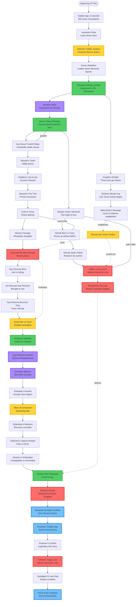

```mermaid
graph TB
    %% Starting Point
    Start([Beginning of Time])

    %% Mythical Era Story Arcs
    GoldenAge[Golden Age of Jamshid<br/>500 years of prosperity]
    Pride[Jamshid's Pride<br/>Loses divine favor]
    Tyranny[Zahhak's 1000yr Tyranny<br/>Serpents feed on brains]
    Rebellion[Kava's Rebellion<br/>Leather apron becomes banner]
    Liberation[Fereydun Defeats Zahhak<br/>Imprisoned in Mt. Damavand]
    Division[Kingdom Divided<br/>Three sons get shares]
    Fratricide[Brothers Murder Iraj<br/>Iran-Turan enmity begins]
    Vengeance[Manuchehr's Revenge<br/>Cycle of violence established]

    %% Rostam Saga
    RostamBirth[Rostam's Birth<br/>Caesarean by Simurgh]
    SevenTrials[Seven Trials of Rostam<br/>Proves himself supreme hero]
    FirstMeeting[Rostam meets Tahmineh<br/>One night of love]
    SohrabBorn[Sohrab Born in Turan<br/>Grows up without father]
    SohrabSeeks[Sohrab Seeks Father<br/>Raised to be warrior]
    TragicDuel[Father vs Son Duel<br/>Neither knows the truth]
    Recognition[Recognition Too Late<br/>Rostam's greatest tragedy]

    %% Court Intrigue Arc
    KavusReign[Kay Kavus' Foolish Reign<br/>Constantly needs rescue]
    SiavashYouth[Siavash's Youth<br/>Noble prince]
    FalseAccusation[Sudaba's Lust & Lies<br/>Accuses Siavash]
    FireOrdeal[Siavash's Fire Trial<br/>Proves innocence]
    Exile[Exile to Turan<br/>Peace attempt]
    Marriage[Marries Farangis<br/>Afrasiyab's daughter]
    Murder[Afrasiyab Murders Siavash<br/>Breaks peace]
    
    %% Revenge Arc
    KhosrowBirth[Kay Khosrow Born<br/>Heir in hiding]
    Rescue[Giv Rescues Kay Khosrow<br/>Brought to Iran]
    AscendThrone[Kay Khosrow Becomes King<br/>Vows revenge]
    GreatWar[Great War vs Turan<br/>Multiple campaigns]
    AfrasiyabDefeat[Afrasiyab Defeated<br/>Justice for Siavash]
    KhosrowAscension[Kay Khosrow Ascends<br/>Mystical disappearance]

    %% Religious Arc
    ZoroasterComes[Zoroaster Appears<br/>New faith revealed]
    GoshtaspConverts[Goshtasp Converts<br/>Accepts new religion]
    ReligiousWars[Wars of Conversion<br/>Spreading faith]
    EsfandiyarMission[Esfandiyar's Missions<br/>Becomes invincible]
    ForcedConflict[Ordered to Capture Rostam<br/>Duty vs honor]
    EpicDuel[Rostam vs Esfandiyar<br/>Unstoppable vs immovable]
    RostamVictory[Rostam Kills Esfandiyar<br/>Arrow to eye]
    RostamDeath[Rostam's Death<br/>Betrayed by brother Shaghad]

    %% Historical Era
    SasanianRise[Sasanian Dynasty Founded<br/>New Persian Empire]
    GoldenAgeSasanian[Khosrow I Golden Age<br/>Justice and learning]
    RomanceEra[Khosrow II & Shirin<br/>Legendary love story]
    FarhadTragedy[Farhad's Tragic Love<br/>Carves mountains, dies]
    FinalKing[Yazdegerd III Last King<br/>Empire crumbles]
    ArabConquest[Fall to Arab Conquest<br/>End of Shahnameh]

    %% Connections - Mythical Era
    Start --> GoldenAge
    GoldenAge --> Pride
    Pride --> Tyranny
    Tyranny --> Rebellion
    Rebellion --> Liberation
    Liberation --> Division
    Division --> Fratricide
    Fratricide --> Vengeance
    Vengeance -.->|establishes| IranTuranWar[Eternal Iran-Turan Conflict]

    %% Rostam Saga Flow
    Liberation --> RostamBirth
    RostamBirth --> SevenTrials
    SevenTrials --> FirstMeeting
    FirstMeeting --> SohrabBorn
    SohrabBorn --> SohrabSeeks
    SohrabSeeks --> TragicDuel
    TragicDuel --> Recognition
    
    %% Court Intrigue Flow
    SevenTrials --> KavusReign
    KavusReign --> SiavashYouth
    SiavashYouth --> FalseAccusation
    FalseAccusation --> FireOrdeal
    FireOrdeal --> Exile
    Exile --> Marriage
    Marriage --> Murder
    
    %% Revenge Arc Flow
    Murder --> KhosrowBirth
    KhosrowBirth --> Rescue
    Rescue --> AscendThrone
    AscendThrone --> GreatWar
    GreatWar --> AfrasiyabDefeat
    AfrasiyabDefeat --> KhosrowAscension

    %% Religious Arc Flow
    KhosrowAscension --> ZoroasterComes
    ZoroasterComes --> GoshtaspConverts
    GoshtaspConverts --> ReligiousWars
    ReligiousWars --> EsfandiyarMission
    EsfandiyarMission --> ForcedConflict
    ForcedConflict --> EpicDuel
    EpicDuel --> RostamVictory
    RostamVictory --> RostamDeath

    %% Historical Flow
    RostamDeath --> SasanianRise
    SasanianRise --> GoldenAgeSasanian
    GoldenAgeSasanian --> RomanceEra
    RomanceEra --> FarhadTragedy
    FarhadTragedy --> FinalKing
    FinalKing --> ArabConquest

    %% Cross-Arc Dependencies
    IranTuranWar -.->|fuels| Murder
    IranTuranWar -.->|context for| TragicDuel
    Recognition -.->|defines| RostamVictory
    Murder -.->|motivates| GreatWar

    %% Parallel Events
    SevenTrials ---|parallel| KavusReign
    FirstMeeting ---|years later| TragicDuel
    Exile ---|same time| SohrabBorn

    %% Styling
    classDef tragedy fill:#ff6b6b,stroke:#c92a2a,stroke-width:3px
    classDef triumph fill:#51cf66,stroke:#2f9e44,stroke-width:3px
    classDef conflict fill:#ffd43b,stroke:#fab005,stroke-width:3px
    classDef mystical fill:#a78bfa,stroke:#7c3aed,stroke-width:3px
    classDef historical fill:#74c0fc,stroke:#1971c2,stroke-width:3px

    class Recognition,Murder,TragicDuel,RostamDeath,FarhadTragedy tragedy
    class Liberation,SevenTrials,AfrasiyabDefeat,RostamVictory triumph
    class Tyranny,GreatWar,ReligiousWars,IranTuranWar conflict
    class KhosrowAscension,ZoroasterComes,RostamBirth mystical
    class SasanianRise,GoldenAgeSasanian,ArabConquest historical
```