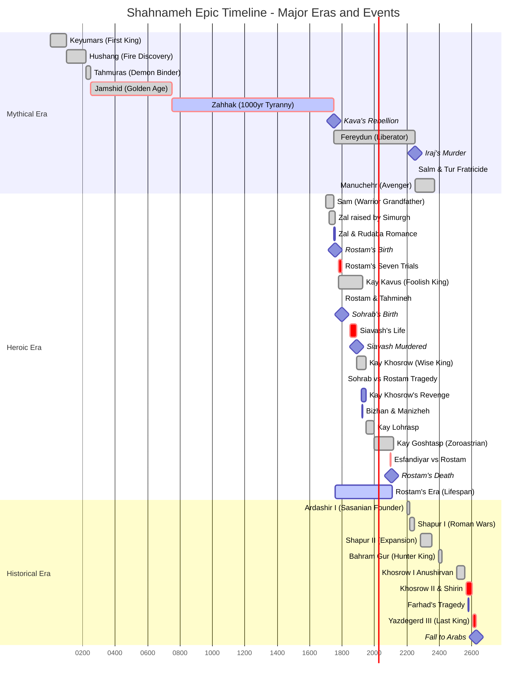

```mermaid
gantt
    title Shahnameh Epic Timeline - Major Eras and Events
    dateFormat YYYY
    axisFormat %Y

    section Mythical Era
    Keyumars (First King)           :done, myth1, 0001, 100y
    Hushang (Fire Discovery)        :done, myth2, after myth1, 120y
    Tahmuras (Demon Binder)         :done, myth3, after myth2, 30y
    Jamshid (Golden Age)            :crit, done, myth4, after myth3, 500y
    Zahhak (1000yr Tyranny)         :crit, active, myth5, after myth4, 1000y
    Kava's Rebellion                :milestone, after myth5 100y
    Fereydun (Liberator)            :done, myth6, after myth5, 500y
    Iraj's Murder                   :milestone, after myth6 50y
    Salm & Tur Fratricide           :crit, after myth6 50y, 1y
    Manuchehr (Avenger)             :done, myth7, after myth6 60y, 120y

    section Heroic Era
    Sam (Warrior Grandfather)       :done, hero1, 1700, 50y
    Zal raised by Simurgh          :done, hero2, 1720, 40y
    Zal & Rudaba Romance           :hero3, 1750, 10y
    Rostam's Birth                 :milestone, 1760
    Rostam's Seven Trials          :crit, hero4, 1780, 20y
    Kay Kavus (Foolish King)       :done, hero5, 1780, 150y
    Rostam & Tahmineh              :hero6, 1800, 1y
    Sohrab's Birth                 :milestone, 1801
    Siavash's Life                 :crit, hero7, 1850, 40y
    Siavash Murdered               :milestone, 1890
    Kay Khosrow (Wise King)        :done, hero8, 1890, 60y
    Sohrab vs Rostam Tragedy       :crit, hero9, 1817, 1y
    Kay Khosrow's Revenge          :hero10, 1920, 30y
    Bizhan & Manizheh             :hero11, 1925, 5y
    Kay Lohrasp                    :done, hero12, 1950, 50y
    Kay Goshtasp (Zoroastrian)    :done, hero13, 2000, 120y
    Esfandiyar vs Rostam          :crit, hero14, 2100, 1y
    Rostam's Death                :milestone, 2110
    Rostam's Era (Lifespan)       :active, rostam_span, 1760, 350y

    section Historical Era
    Ardashir I (Sasanian Founder)  :done, hist1, 2200, 18y
    Shapur I (Roman Wars)          :done, hist2, 2218, 30y
    Shapur II (Expansion)          :done, hist3, 2287, 70y
    Bahram Gur (Hunter King)       :done, hist4, 2398, 18y
    Khosrow I Anushirvan          :done, hist5, 2509, 48y
    Khosrow II & Shirin           :crit, hist6, 2568, 38y
    Farhad's Tragedy              :hist7, 2580, 5y
    Yazdegerd III (Last King)     :crit, hist8, 2610, 19y
    Fall to Arabs                 :milestone, 2629
```